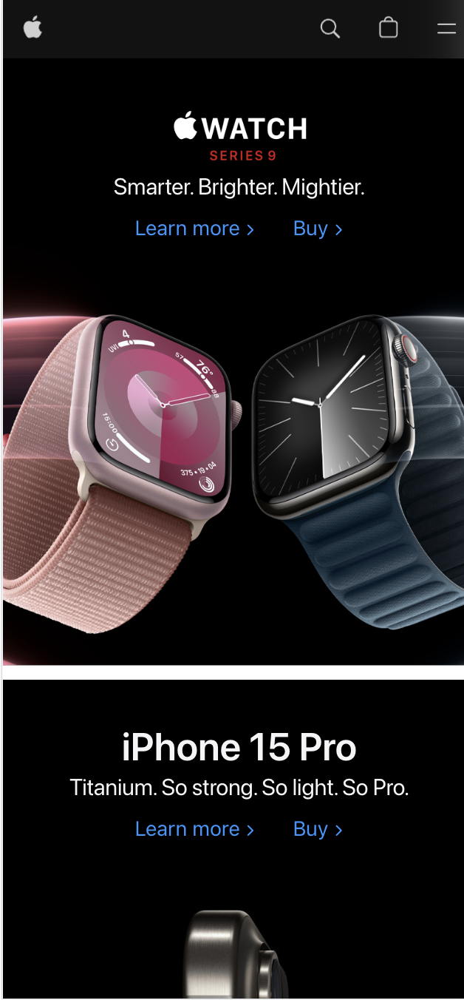
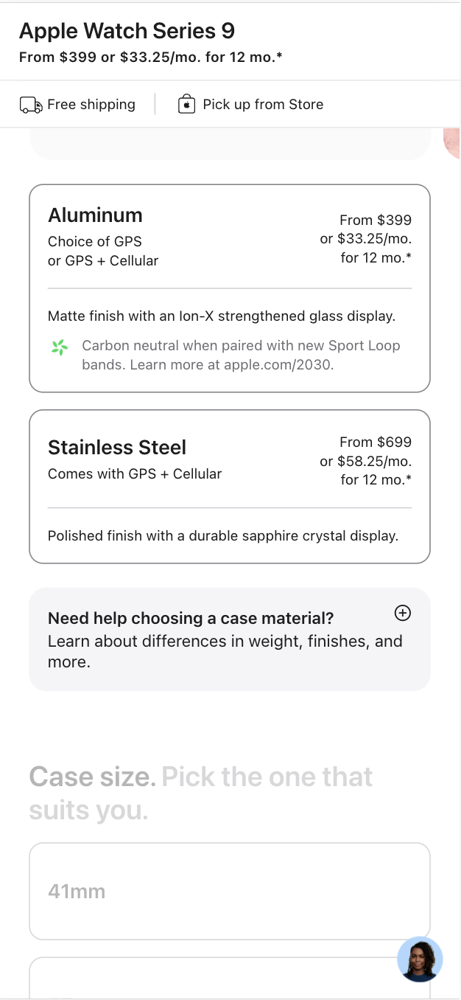

# Procesverslag
Markdown is een simpele manier om HTML te schrijven.  
Markdown cheat cheet: [Hulp bij het schrijven van Markdown](https://github.com/adam-p/markdown-here/wiki/Markdown-Cheatsheet).

Nb. De standaardstructuur en de spartaanse opmaak van de README.md zijn helemaal prima. Het gaat om de inhoud van je procesverslag. Besteedt de tijd voor pracht en praal aan je website.

Nb. Door *open* toe te voegen aan een *details* element kun je deze standaard open zetten. Fijn om dat steeds voor de relevante stuk(ken) te doen.

## Jij

  
uitwerken voor kick-off werkgroep

  ### Auteur:
  Daniël Post 

  #### Je startniveau:
  Blauw

  #### Je focus:
  Responsive
 

## Je website

  
uitwerken voor kick-off werkgroep

  ### Je opdracht:
  https://www.apple.com/nl/

  #### Screenshot(s) van de eerste pagina (small screen): 
  
  

  #### Screenshot(s) van de tweede pagina (small screen):
 
  
 

## Toegankelijkheidstest 1/2 (week 1)

  
uitwerken na test in 2e werkgroep

  ### Bevindingen
  Lijst met je bevindingen die in de test naar voren kwamen:

  Plusjes: 
- screenreader leest woorden voor uit de linkjes zodat er, inplaats van “lees meer” wordt er wat meer informatie voorgelezen over de pagina waar het linkje naar toe leidt.
- Apple maakt veelal gebruik van Div elementen in de HTML.

## Breakdownschets (week 1)

  
uitwerken na afloop 3e werkgroep

  ### de hele pagina: 
  

  ### dynamisch deel (bijv menu): 
  

  ### wellicht nog een dynamisch deel (bijv filter): 
  

## Voortgang 1 (week 2)

  
uitwerken voor 1e voortgang

  ### Stand van zaken
  hier dit ging goed & dit was lastig (neem ook screenshots op van delen van je website en code)

  Deze week ben ik begonnen met het maken van mijn opdracht, door wat een andere deadline voor een herkansing had ik deze 
  week niet super veel tijd maar dat is afgerond. Ik heb voor mijzelf wel duidelijk hoe ik het wil gaan doen. Ik loop nu tegen 
  een aantal problemen/vragen. 
  
  1 Hoe zorg ik ervoor dat mijn afbeelding veranderd wanneer het scherm groter wordt? 

  2 Hoe zet ik een linkje op een afbeelding?

  3 Voor mijn header heb ik 4 icons, waarvan ik er 1 wil uitlijnen links boven en de andere 3 rechtsboven. Ik heb het geprobeerd met flexbox te veranderen
  maar op de pagina werkt het niet (zie screenshot)

  
  

  ### Agenda voor meeting
  samen met je groepje opstellen

  | Daniel     | student 2          | student 3    | student 4        |
  | ---            | ---                | ---          | ---              |
  | dit bespreken  | en dit             | en ik dit    | en dan ik dat    |
  | en dat ook nog | dit als er tijd is | nog een punt | dit wil ik zeker |
  | ...            | ...                | ...          | ...              |

  Daniel: 
  
  1 Hoe zorg ik ervoor dat mijn afbeelding veranderd wanneer het scherm groter wordt? 

  2 Hoe zet ik een linkje op een afbeelding?

  3 Voor mijn header heb ik 4 icons, waarvan ik er 1 wil uitlijnen links boven en de andere 3 rechtsboven. Ik heb het geprobeerd met flexbox te veranderen
  maar op de pagina werkt het niet (zie screenshot)

  Nicholas

    Foto als achtergrond
    margin links en rechts voor de hele pagina behalve de achtergrond

  Ruby: 
  Ik heb elementen hidden op scherm maar wel laten lezen door screenreaders

  Beyzanur:

  Ik wil een video toevoegen, maar ik wil niet dat deze automatisch begint wanneer je de pagina opent. Ik wil dat je zelf kunt klikken om de video te starten

  ### Verslag van meeting
  hier na afloop snel de uitkomsten van de meeting vastleggen

  - punt 1
  - punt 2
  - nog een punt
  - ...

## Voortgang 2 (week 3)

  
uitwerken voor 2e voortgang

  ### Stand van zaken
  hier dit ging goed & dit was lastig (neem ook screenshots op van delen van je website en code)

  ### Agenda voor meeting
  samen met je groepje opstellen

  | student 1      | student 2          | student 3    | student 4        |
  | ---            | ---                | ---          | ---              |
  | dit bespreken  | en dit             | en ik dit    | en dan ik dat    |
  | en dat ook nog | dit als er tijd is | nog een punt | dit wil ik zeker |
  | ...            | ...                | ...          | ...              |

  ### Verslag van meeting
  hier na afloop snel de uitkomsten van de meeting vastleggen

  - punt 1
  - punt 2
  - nog een punt
- ...

## Toegankelijkheidstest 2/2 (week 4)

  
uitwerken na test in 9e werkgroep

  ### Bevindingen
  Lijst met je bevindingen die in de test naar voren kwamen (geef ook aan wat er verbeterd is):

## Voortgang 3 (week 4)

  
uitwerken voor 3e voortgang

  ### Stand van zaken
  hier dit ging goed & dit was lastig (neem ook screenshots op van delen van je website en code)

  ### Agenda voor meeting
  samen met je groepje opstellen

  | student 1      | student 2          | student 3    | student 4        |
  | ---            | ---                | ---          | ---              |
  | dit bespreken  | en dit             | en ik dit    | en dan ik dat    |
  | en dat ook nog | dit als er tijd is | nog een punt | dit wil ik zeker |
  | ...            | ...                | ...          | ...              |

  ### Verslag van meeting
  hier na afloop snel de uitkomsten van de meeting vastleggen

  - punt 1
  - punt 2
  - nog een punt
  - ...

## Eindgesprek (week 5)

  
uitwerken voor eindgesprek

  ### Je uitkomst - karakteristiek screenshots:
  

  ### Dit ging goed/Heb ik geleerd: 
  Korte omschrijving met plaatjes

  

  ### Dit was lastig/Is niet gelukt:
  Korte omschrijving met plaatjes

  

## Bronnenlijst

  
continu bijhouden terwijl je werkt

  Nb. Wees specifiek ('css-tricks' als bron is bijv. niet specifiek genoeg). 
  Nb. ChatGpT en andere AI horen er ook bij.
  Nb. Vermeld de bronnen ook in je code.

  1. bron 1
  2. bron 2
  3. ...

